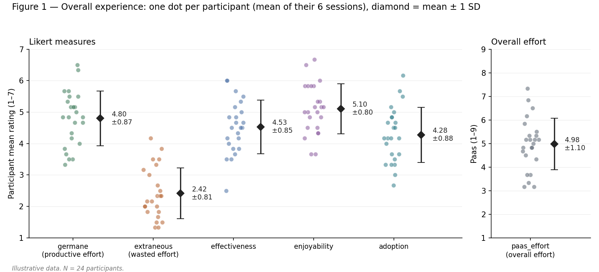
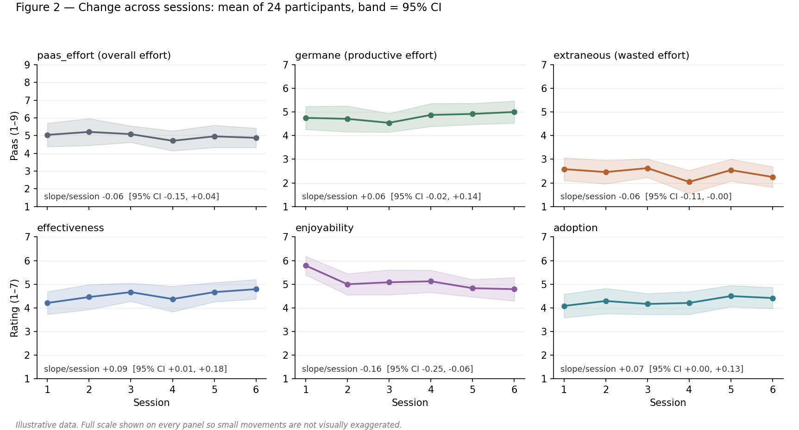
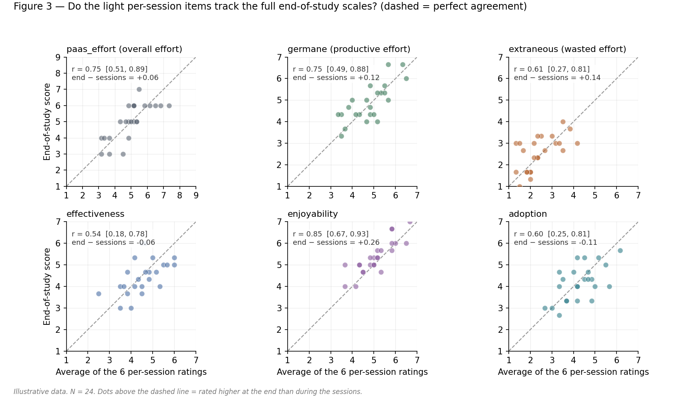

# RQ2 — How do users experience SoftVoicesAI?

> **Illustrative data.** N = 24 participants × 6 sessions (144 per-session ratings) + 1 end-of-study questionnaire.
> RQ2 is **descriptive and exploratory**. No hypothesis tests, no p-values, no significance claims.

Measures: overall mental effort (Paas, 1–9), productive effort (germane) and wasted effort (extraneous), perceived effectiveness, enjoyability, willingness to adopt (all 1–7).

Unit of analysis is the **participant**, not the rating. Each participant's 6 session ratings are averaged first, so one person who rated a lot cannot count more than anyone else.

---

## 1. Overall experience

**How to read it.**
- Each coloured dot is one person's average across their 6 sessions — 24 dots per measure.
- The black diamond is the group mean;
- the whisker is ±1 SD (standard deviation — the typical distance from the mean). Wide spread = people disagreed. Tight spread = people converged.

**Reading of these data**

- **Effort felt productive, not wasted.** Germane (4.80) sits well above extraneous (2.42), and the two clouds of dots barely overlap. This is the central RQ2 result: the tool asked something of people, and that something mostly landed on the topic rather than on confusion.
- **Overall effort was moderate.** Paas ≈ 5.0 on a 1–9 scale — engaged, not overloaded. Worth pairing with the ~15 min session length.
- **Enjoyability (5.10) > effectiveness (4.53) > adoption (4.28).** People liked it more than they judged it useful, and judged it useful more than they wanted it. The gap between "enjoyable in a study" and "I'd install this" is the honest finding to report, not something to explain away.
- **Adoption is the most spread-out measure** (SD 0.88, dots from ~2.7 to ~6.2). Something is splitting participants. The interview data (RQ3) is where to look for what.

---

## 2. Change across sessions

**How to read it.** Line = mean of 24 participants at that session. Shaded band = 95% confidence interval (the range the true mean plausibly sits in). The slope is fitted per participant, then averaged; its CI is across the 24 participants. Every panel shows the **full scale** so a 0.3-point wiggle does not look like a cliff.

**Reading of these data**

- **Five of six measures are flat.** Their CIs cross or nearly touch zero and the bands overlap heavily across sessions. Report them as flat. No story.
- **Enjoyability declines** (−0.16/session, CI −0.25 to −0.06 → roughly −0.8 over the six sessions). Session 1 is the outlier; sessions 2–6 are nearly level. Read as **novelty fading, then stabilising**, not as steady decay.
- **Nothing here is a hypothesis test.** With 24 participants, single-item measures, and six timepoints, these slopes describe *this sample*. They are not evidence about repeated use in general.

**Important Caveat** Session and post are crossed by the 6×6 Latin square, so a "session effect" is not confounded with any particular post. But the same ratings can be re-plotted **by post**, and if post-to-post variation is large, that is the better explanation for the bumpiness above.

---

## 3. Do the light per-session items track the full end-of-study scales?

**Why this exists.** The per-session questionnaire uses one item per construct to keep six sessions bearable. This figure checks whether that shortcut cost anything.

**How to read it.** X = a participant's average of their 6 single-item ratings. Y = their end-of-study score (average of 3 items). Dashed line = perfect agreement. **r** is the correlation (1 = perfectly ranked the same, 0 = unrelated). "end − sessions" is the average vertical shift off the dashed line.

**Reading of these data**

- **Enjoyability, germane, and Paas effort agree well** (r ≈ 0.75–0.85). The one-item version ranked people the same way the full scale did. Safe to trust the light items for these.
- **Effectiveness agrees least** (r = 0.54, CI 0.18–0.78). Note how wide that CI is — with 24 people, r = 0.54 is compatible with "weak" and with "strong." Do not draw a line at some threshold and declare pass/fail.
- **Enjoyability sits above the line** (+0.26). People remembered the sessions as slightly more enjoyable than they rated them in the moment. A small recall effect, worth a sentence.
- **A low r is not automatically a bad item.** It can also mean everyone scored similarly, leaving little spread to correlate. Check the x-axis range before blaming the item.

---

## 4. Reliability of the end-of-study scales

**Cronbach's alpha** asks whether the 3 items in a scale move together enough to justify averaging them. The conventional bar is 0.70 — but alpha is penalised for having few items, so for 3-item scales the **mean inter-item correlation** (0.15–0.50 is healthy for a broad construct) is the fairer read.

| Scale (3 items) | α | 95% CI | Mean inter-item _r_ |
| --- | --- | --- | --- |
| effectiveness | 0.86 | 0.72 – 0.93 | 0.67 |
| extraneous | 0.81 | 0.63 – 0.91 | 0.59 |
| enjoyability | 0.79 | 0.59 – 0.90 | 0.56 |
| germane | 0.78 | 0.57 – 0.90 | 0.54 |
| adoption | 0.64 | 0.29 – 0.83 | 0.37 |

_(Overall effort is a single Paas item — alpha does not apply.)_

**Reading of these data**

- **The CIs are the point.** At N = 24 every one of these intervals is roughly half a scale wide. A pass/fail verdict column would be false precision.
- **Adoption at 0.64 is not a failure.** Its mean inter-item r of 0.37 is perfectly respectable. "I'd use it," "I'd recommend it," and "I'd want it built into apps I use" are three genuinely different commitments, so they *should* hang together loosely.
- **Keep averaging adoption. Flag it, don't fix it.** Report the alpha, note it is the least internally consistent scale, and let adoption conclusions carry that caveat. Do **not** drop the weakest item to push alpha over 0.70 — with 24 people that is fishing, and the boosted number would not survive replication.

