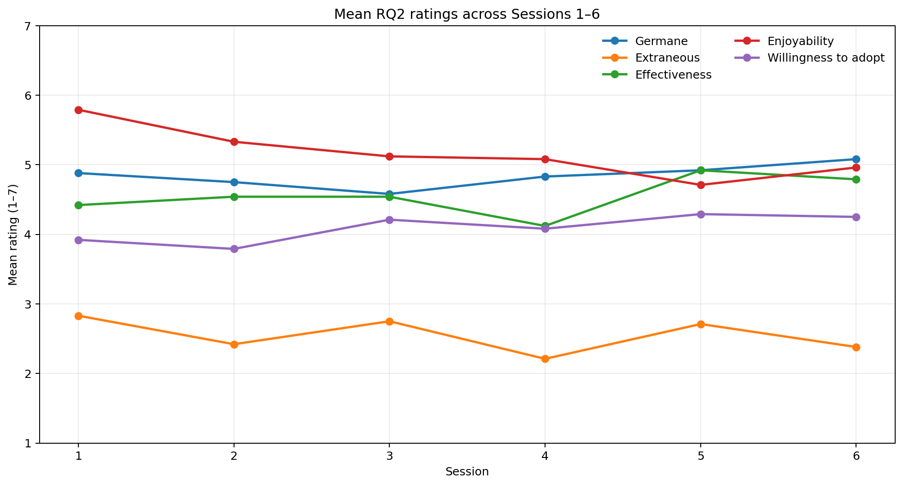
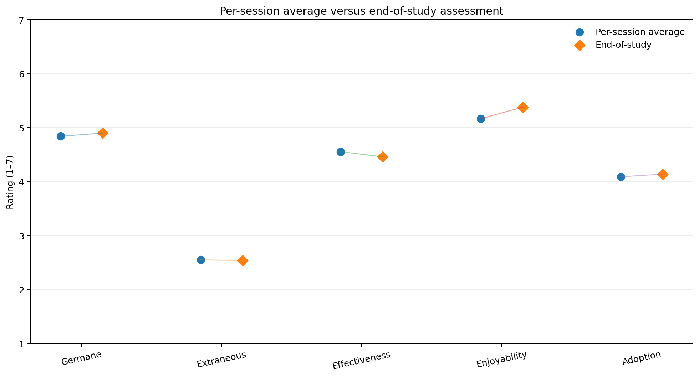

**Fake Data Illustrative example only.** 

# RQ2 Example Report — User Experience of SoftVoicesAI

 RQ2 concerns cognitive load and user experience: mental effort, productive/germane effort, wasted/extraneous effort, perceived effectiveness, enjoyability, and willingness to adopt.

---

## Recommended RQ2 output at a glance

The main report uses **four figures and four matching tables**:

1. **Overall participant-level distribution** for the five 1–7 measures.
2. **Trend across Sessions 1–6** for the five 1–7 measures.
3. **Per-session average versus end-of-study assessment** for the five 1–7 measures.
4. End-of-study scale reliability
---

# 1. Overall participant-level experience

Each dot represents **one participant's average across the six sessions**. The diamond shows the mean and the whisker shows ±1 SD.

This figure answers:

> **How positive or negative was the overall experience, and how much did participants differ from one another?**

Enjoyment and productive effort are relatively high, wasted effort is relatively low, and adoption is more moderate.

**=No population-level generalizability, Only 24 participants, descriptive only** 

### Matching table

| Measure | Mean | SD |
|---|---:|---:|
| Germane / productive effort | 4.84 | 0.78 |
| Extraneous / wasted effort | 2.55 | 0.81 |
| Effectiveness | 4.56 | 0.80 |
| Enjoyability | 5.17 | 0.78 |
| Willingness to adopt | 4.09 | 0.80 |

---

# 2. Trend across repeated sessions

| . | . |
|---|---|
|  |  |

This figure answers:

> **Does the experience change as participants use SoftVoicesAI repeatedly?**

Fairly stable for most measures, with a clearer downward movement in enjoyment.

- Enjoyment declines from **5.79** in Session 1 to **4.96** in Session 6.
- Effectiveness fluctuates but finishes above its Session 1 value.
- Adoption remains relatively stable.
- Extraneous effort stays comparatively low.

> **The user experience was broadly stable across the six sessions, with enjoyment showing the clearest downward trend in the sR.**

Paas mental effort is kept in a separate figure because the questionnaire uses a **1–9 scale for Paas**, whereas the other RQ2 session items use **1–7 scales**.
The illustrative values stay near the middle of the scale:

- Session 1: **5.12**
- Session 6: **5.00**

This suggests no large change in perceived total mental effort across repeated use.

### Matching table

|   Session |   Germane |   Extraneous |   Effectiveness |   Enjoyability |   Adoption |
|----------:|----------:|-------------:|----------------:|---------------:|-----------:|
|         1 |      4.88 |         2.83 |            4.42 |           5.79 |       3.92 |
|         2 |      4.75 |         2.42 |            4.54 |           5.33 |       3.79 |
|         3 |      4.58 |         2.75 |            4.54 |           5.12 |       4.21 |
|         4 |      4.83 |         2.21 |            4.12 |           5.08 |       4.08 |
|         5 |      4.92 |         2.71 |            4.92 |           4.71 |       4.29 |
|         6 |      5.08 |         2.38 |            4.79 |           4.96 |       4.25 |

### Matching table

|   Session |   Paas mental effort |
|----------:|---------------------:|
|         1 |                 5.12 |
|         2 |                 5.38 |
|         3 |                 5.42 |
|         4 |                 4.79 |
|         5 |                 4.96 |
|         6 |                 5    |

---

# 3. Per-session ratings versus end-of-study assessment

The end-of-study questionnaire uses fuller multi-item versions of the RQ2 constructs, while each session uses one item per construct to minimize burden.

### Matching table

| Measure       |   Per-session average |   End-of-study |
|:--------------|----------------------:|---------------:|
| Germane       |                  4.84 |           4.9  |
| Extraneous    |                  2.55 |           2.54 |
| Effectiveness |                  4.56 |           4.46 |
| Enjoyability  |                  5.16 |           5.38 |
| Adoption      |                  4.09 |           4.14 |

---

# 4. End-of-study scale reliability

| Scale | Items | Cronbach's α | Interpretation |
|---|---:|---:|---|
| Effectiveness | 3 | 0.xx | Report value; interpret in context |
| Enjoyment | 3 | 0.xx | Report value; interpret in context |
| Productive effort | 3 | 0.xx | Report value; interpret in context |
| Wasted effort | 3 | 0.xx | Report value; interpret in context |
| Adoption | 3 | 0.64* | Lower internal consistency; interpret cautiously |

> "The adoption scale showed lower internal consistency than the other end-of-study scales (α = .64), so adoption results were interpreted cautiously."

---

# 5. Discussion

### Overall experience

Participants generally reported a positive experience, with relatively high enjoyment and productive effort and lower wasted effort. Willingness to adopt was somewhat more moderate than enjoyment. This pattern suggests that the system required meaningful cognitive effort without making participants feel that most of that effort was caused by confusion or clutter.

### Across sessions

Ratings were broadly stable across the six sessions. Enjoyment showed the clearest decline, from 5.79 in Session 1 to 4.96 in Session 6 in the data, while effectiveness and adoption were comparatively stable.

This pattern may be consistent with reduced novelty over repeated sessions, although the study does not establish why enjoyment changed.

### End-of-study assessment

The end-of-study multi-item ratings broadly matched the averages of the lightweight per-session ratings. 

### Overall RQ2 interpretation

> **SoftVoicesAI was experienced as cognitively effortful but generally worthwhile, with low-to-moderate wasted effort and relatively positive effectiveness and enjoyment ratings. The overall experience remained fairly stable across repeated use, although enjoyment showed some decline.**

Because the sample is small and the study is a one-condition within-subject design, these results should be presented as **descriptive evidence about this sample and system**, rather than as strong evidence that the interface would produce the same experience in a broader population.

---

**Figure 1:** overall participant-level distribution  
**Figure 2:** 1–7 measure trends  
**Figure 3:** Paas effort trend  
**Figure 4:** per-session vs. end-of-study  
**Table 1:** end-of-study reliability

