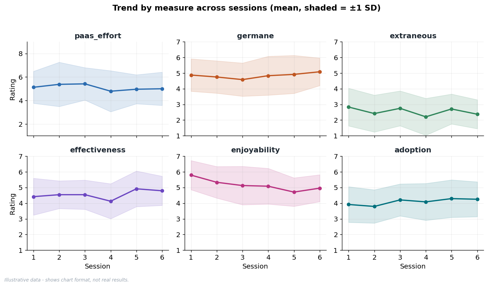
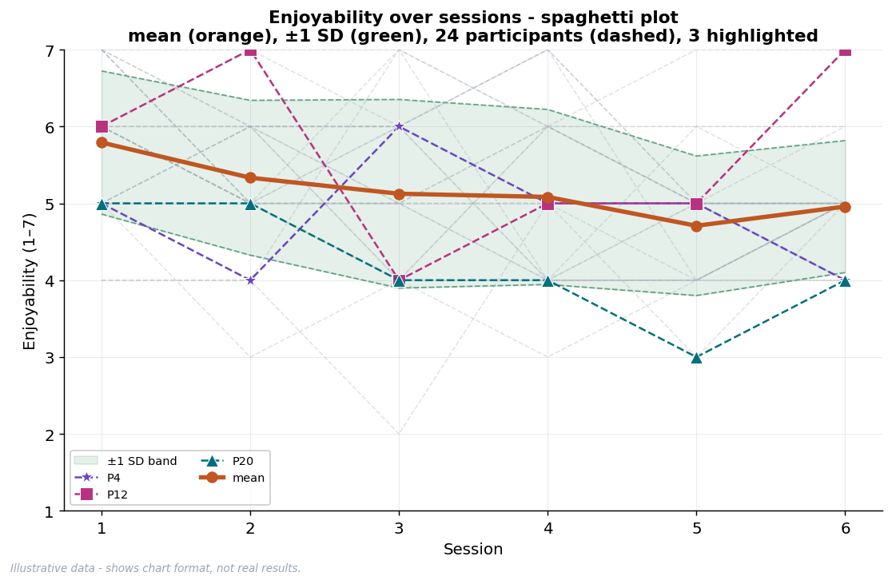
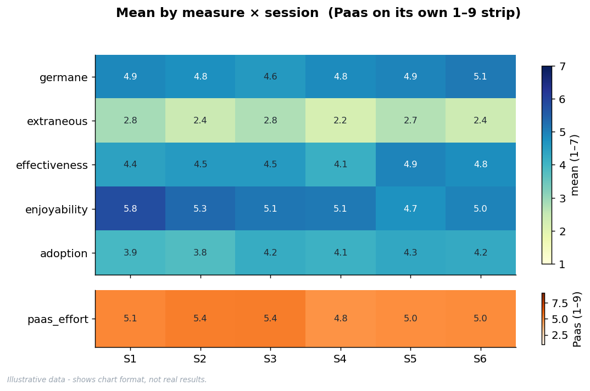
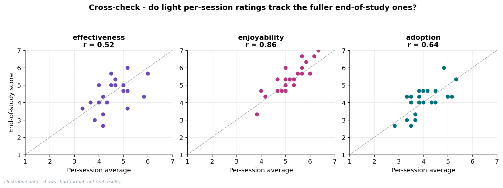

# RQ2 - Example Outputs *(illustrative)*

> **Fake data**, N = 24 participants x 6 sessions. .

---

##  Per-session summary  

*(table: `per_session`, 144 rows)*

| measure | mean | SD | min | max | n |
|---|---|---|---|---|---|
| paas_effort | 5.11 | 1.51 | 1 | 8 | 144 |
| germane | 4.84 | 1.08 | 2 | 7 | 144 |
| extraneous | 2.55 | 1.10 | 1 | 5 | 144 |
| effectiveness | 4.56 | 1.05 | 2 | 7 | 144 |
| enjoyability | 5.17 | 1.06 | 2 | 7 | 144 |
| adoption | 4.09 | 1.12 | 2 | 7 | 144 |

## Trend across sessions 

*(table: `per_session`)*

**Mean per session** (each cell = average of 24 participants):

| measure | S1 | S2 | S3 | S4 | S5 | S6 |
|---|---|---|---|---|---|---|
| paas_effort | 5.12 | 5.38 | 5.42 | 4.79 | 4.96 | 5.00 |
| germane | 4.88 | 4.75 | 4.58 | 4.83 | 4.92 | 5.08 |
| extraneous | 2.83 | 2.42 | 2.75 | 2.21 | 2.71 | 2.38 |
| effectiveness | 4.42 | 4.54 | 4.54 | 4.12 | 4.92 | 4.79 |
| enjoyability | 5.79 | 5.33 | 5.12 | 5.08 | 4.71 | 4.96 |
| adoption | 3.92 | 3.79 | 4.21 | 4.08 | 4.29 | 4.25 |

**Session slope** (per-participant slope on session, averaged; + rises, - falls):

| measure | slope / session | p | reading |
|---|---|---|---|
| paas_effort | -0.071 | 0.139 | falls slightly |
| germane | +0.051 | 0.273 | rises slightly |
| extraneous | -0.056 | 0.131 | falls slightly |
| effectiveness | +0.074 | 0.088 | rises slightly |
| enjoyability | -0.174 | 0.000 * | falls slightly |
| adoption | +0.087 | 0.104 | rises slightly |

| . | . |
|---|---|
|  |  | 
| . | . |

##  End-of-study  

*(table: `end_study`, 24 rows)*

**Cronbach's alpha** (>= 0.70 = items agree, safe to average):

| scale (3 items) | alpha | verdict |
|---|---|---|
| productive | 0.78 | pass |
| wasted | 0.81 | pass |
| effectiveness | 0.86 | pass |
| enjoyability | 0.79 | pass |
| adoption | 0.64 | below 0.70 |

*(overall_effort is a single Paas item - no alpha.)*

**End-of-study summary** (scale scores, across 24 participants):

| measure | mean | SD |
|---|---|---|
| overall_effort | 5.04 | 1.08 |
| productive | 4.90 | 0.88 |
| wasted | 2.54 | 0.84 |
| effectiveness | 4.46 | 0.84 |
| enjoyability | 5.38 | 0.84 |
| adoption | 4.14 | 0.79 |

## Cross-check 

*(per-session average vs end-of-study score)*

| per-session <-> end-of-study | r | verdict |
|---|---|---|
| paas_effort <-> overall_effort | 0.87 | trust light items |
| germane <-> productive | 0.79 | trust light items |
| extraneous <-> wasted | 0.69 | partial |
| effectiveness <-> effectiveness | 0.52 | partial |
| enjoyability <-> enjoyability | 0.86 | trust light items |
| adoption <-> adoption | 0.64 | partial |

---

### Figure index
- `01_trends_small_multiples.png` - trend of all 6 measures across sessions
- `02_spread_box_mean_sd.png` - spread per measure - box + mean+/-SD + 24 dots
- `03_germane_vs_extraneous.png` - germane vs extraneous - per-session means AND end-of-study
- `04_spaghetti_enjoyability.png` - enjoyability spaghetti - mean, SD band, participants
- `05_crosscheck.png` - per-session vs end-of-study agreement
- `06_means_heatmap.png` - compact overview of means (Paas on its own strip)
