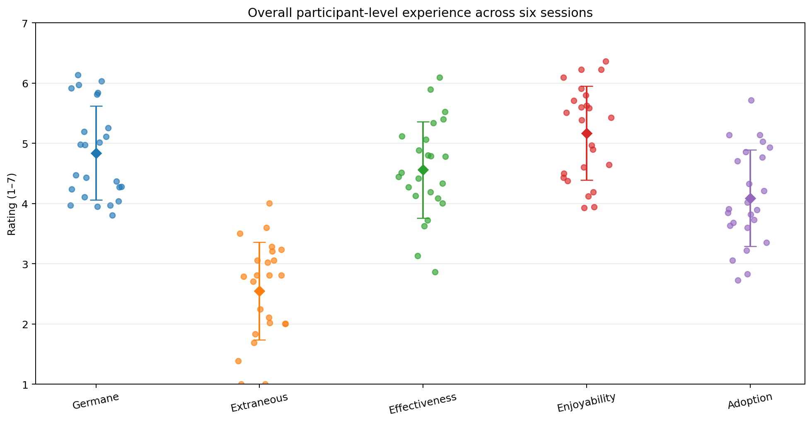
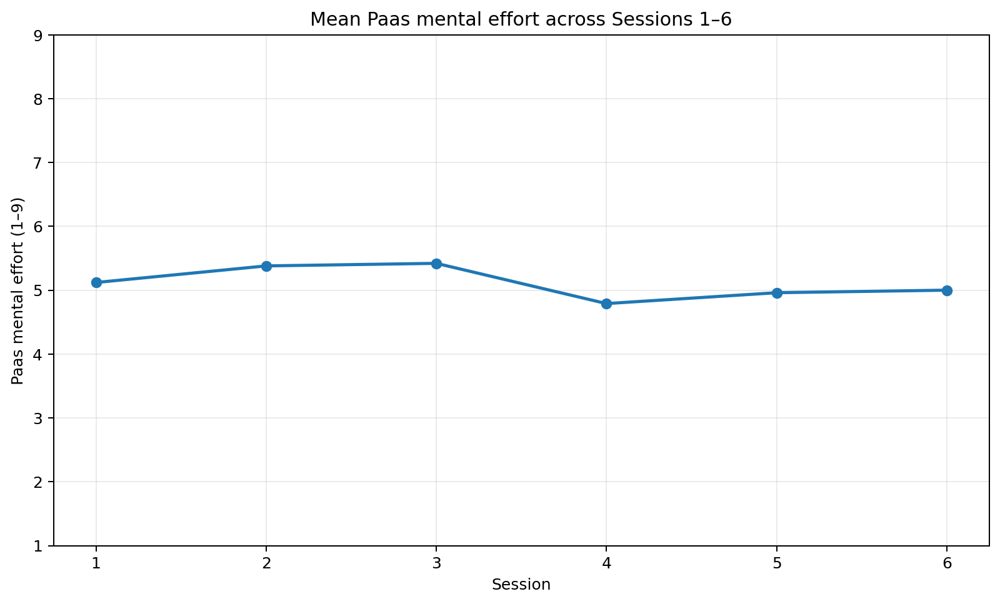

# RQ2 Example Report — User Experience of SoftVoicesAI

> **Fake Data Illustrative example only.** 

> RQ2 concerns cognitive load and user experience: mental effort, productive/germane effort, wasted/extraneous effort, perceived effectiveness, enjoyability, and willingness to adopt. The research proposal states that these measures are summarized as averages, including trends across the six sessions, with the end-of-study questionnaire used as a check on the lighter per-session ratings.

---

## Recommended RQ2 output at a glance

The main report uses **four figures and four matching tables**:

1. **Overall participant-level distribution** for the five 1–7 measures.
2. **Trend across Sessions 1–6** for the five 1–7 measures.
3. **Paas mental-effort trend** shown separately because it uses a 1–9 scale.
4. **Per-session average versus end-of-study assessment** for the five 1–7 measures.

A small reliability table should be added for the end-of-study multi-item scales; it is not repeated as a graph because the alpha values are the information that needs to be reported.

---

# 1. Overall participant-level experience

## Figure 1

### How to interpret

Each dot represents **one participant's average across the six sessions**. The diamond shows the mean and the whisker shows ±1 SD.

This figure answers:

> **How positive or negative was the overall experience, and how much did participants differ from one another?**

In the illustrative data, enjoyment and productive effort are relatively high, wasted effort is relatively low, and adoption is more moderate.

The important cognitive-load interpretation is that **moderate mental effort is not inherently bad**. RQ2 distinguishes productive effort from wasted effort: the desirable pattern is effort that feels worthwhile rather than effort caused by confusion or clutter. The per-session questionnaire makes this distinction explicitly. fileciteturn0file3L3-L8

**Do not infer population-level generalizability from these distributions.** With approximately 24 participants, the figure is primarily descriptive.

### Matching table

| Measure | Mean | SD |
|---|---:|---:|
| Germane / productive effort | 4.84 | 0.78 |
| Extraneous / wasted effort | 2.55 | 0.81 |
| Effectiveness | 4.56 | 0.80 |
| Enjoyability | 5.17 | 0.78 |
| Willingness to adopt | 4.09 | 0.80 |

---

# 2. Trend across repeated sessions

## Figure 2 — 1–7 measures

### How to interpret

This figure answers:

> **Does the experience change as participants use SoftVoicesAI repeatedly?**

The illustrative pattern is fairly stable for most measures, with a clearer downward movement in enjoyment.

For example:

- Enjoyment declines from **5.79** in Session 1 to **4.96** in Session 6.
- Effectiveness fluctuates but finishes above its Session 1 value.
- Adoption remains relatively stable.
- Extraneous effort stays comparatively low.

The safest wording is therefore:

> **The user experience was broadly stable across the six sessions, with enjoyment showing the clearest downward trend in the illustrative data.**

That is stronger and more useful than turning every small fluctuation into a significance claim.

### Matching table

|   Session |   Germane |   Extraneous |   Effectiveness |   Enjoyability |   Adoption |
|----------:|----------:|-------------:|----------------:|---------------:|-----------:|
|         1 |      4.88 |         2.83 |            4.42 |           5.79 |       3.92 |
|         2 |      4.75 |         2.42 |            4.54 |           5.33 |       3.79 |
|         3 |      4.58 |         2.75 |            4.54 |           5.12 |       4.21 |
|         4 |      4.83 |         2.21 |            4.12 |           5.08 |       4.08 |
|         5 |      4.92 |         2.71 |            4.92 |           4.71 |       4.29 |
|         6 |      5.08 |         2.38 |            4.79 |           4.96 |       4.25 |

---

## Figure 3 — Paas mental effort

### How to interpret

Paas mental effort is kept in a separate figure because the questionnaire uses a **1–9 scale for Paas**, whereas the other RQ2 session items use **1–7 scales**. fileciteturn0file3L10-L12

The illustrative values stay near the middle of the scale:

- Session 1: **5.12**
- Session 6: **5.00**

This suggests no large change in perceived total mental effort across repeated use.

However, Paas effort alone cannot tell us whether that effort was good or bad. The interpretation should be paired with the germane/productive and extraneous/wasted measures.

### Matching table

|   Session |   Paas mental effort |
|----------:|---------------------:|
|         1 |                 5.12 |
|         2 |                 5.38 |
|         3 |                 5.42 |
|         4 |                 4.79 |
|         5 |                 4.96 |
|         6 |                 5    |

---

## Should we report slopes and p-values?

For this study, I would treat slopes as **exploratory descriptive summaries**, not as the centerpiece of RQ2.

A useful supplementary statistic is:

> **change per session**, ideally with a confidence interval.

The illustrative enjoyment slope of about −0.17 points per session corresponds to roughly a **0.87-point decrease from Session 1 to Session 6**.

I would avoid making six p-values the headline result. The design has approximately 24 participants, six repeated sessions, six RQ2 outcomes, and single-item per-session measures. The proposal itself frames the RQ2 session analysis as summary/trend analysis rather than as a confirmatory hypothesis-testing framework. fileciteturn0file1L154-L157

---

# 3. Per-session ratings versus end-of-study assessment

## Figure 4

### How to interpret

The end-of-study questionnaire uses fuller multi-item versions of the RQ2 constructs, while each session uses one item per construct to minimize burden. fileciteturn0file1L143-L147

This figure therefore asks:

> **Does the fuller end-of-study assessment tell roughly the same story as the lightweight ratings collected after each session?**

In the illustrative data, the two summaries are broadly similar:

- Germane: **4.84 vs. 4.90**
- Extraneous: **2.55 vs. 2.54**
- Effectiveness: **4.56 vs. 4.46**
- Enjoyment: **5.17 vs. 5.38**
- Adoption: **4.09 vs. 4.14**

That is a useful cross-check, but the measures should **not** be treated as identical instruments. The per-session measure is a single item, while the end-of-study version combines three items for each scale. 

### Matching table

| Measure       |   Per-session average |   End-of-study |
|:--------------|----------------------:|---------------:|
| Germane       |                  4.84 |           4.9  |
| Extraneous    |                  2.55 |           2.54 |
| Effectiveness |                  4.56 |           4.46 |
| Enjoyability  |                  5.16 |           5.38 |
| Adoption      |                  4.09 |           4.14 |

---

# 4. End-of-study scale reliability

A small table is preferable here because Cronbach's alpha is not something that needs another graph.

### Suggested table

| Scale | Items | Cronbach's α | Interpretation |
|---|---:|---:|---|
| Effectiveness | 3 | 0.xx | Report value; interpret in context |
| Enjoyment | 3 | 0.xx | Report value; interpret in context |
| Productive effort | 3 | 0.xx | Report value; interpret in context |
| Wasted effort | 3 | 0.xx | Report value; interpret in context |
| Adoption | 3 | 0.64* | Lower internal consistency; interpret cautiously |

\* The supplied illustrative output gives adoption α = 0.64 and the other example values as 0.78–0.86. Those values are illustrative, not study results. The end-of-study questionnaire contains three items for each of the corresponding multi-item scales. fileciteturn0file2L7-L23 fileciteturn0file2L33-L43

### Important reporting change

Do **not** label α ≥ .70 as "pass" and α < .70 as "fail."

Instead:

> **Report alpha and describe the degree of internal consistency.**

For example:

> "The adoption scale showed lower internal consistency than the other end-of-study scales (α = .64), so adoption results were interpreted cautiously."

That is much safer than declaring the scale invalid based on a single cutoff.

---

# 5. What is deliberately not in the main RQ2 output?

## Spaghetti plot

Not recommended for the main text.

With 24 participants × 6 sessions, it is likely to become visual noise. It is useful only if the research question specifically asks whether individual trajectories differ substantially.

A single spaghetti plot can be placed in supplementary material if an interesting participant-level pattern emerges.

## Heatmap

Useful as a **supplementary overview**, but not essential.

A heatmap of the five 1–7 measures can compactly show where mean ratings are relatively high or low across sessions. Because Paas uses a 1–9 scale, it should either be displayed separately or normalized before being combined with the 1–7 measures. fileciteturn0file3L10-L12

The trend plot is easier to interpret when the question is specifically about change over time.

## Large per-session summary tables

Not recommended in the main text.

Once the trend figure is present, a table containing the same six session means adds little. The matching table is included here because this is an **example report demonstrating figure/table correspondence**, but in the real manuscript I would usually keep the table in supplementary material or the analysis appendix.

---

# 6. Concise RQ2 discussion example

### Overall experience

Participants generally reported a positive experience, with relatively high enjoyment and productive effort and lower wasted effort. Willingness to adopt was somewhat more moderate than enjoyment. This pattern suggests that the system required meaningful cognitive effort without making participants feel that most of that effort was caused by confusion or clutter.

### Across sessions

Ratings were broadly stable across the six sessions. Enjoyment showed the clearest decline, from 5.79 in Session 1 to 4.96 in Session 6 in the illustrative data, while effectiveness and adoption were comparatively stable.

This pattern may be consistent with reduced novelty over repeated sessions, although the study does not establish why enjoyment changed.

### End-of-study assessment

The end-of-study multi-item ratings broadly matched the averages of the lightweight per-session ratings. This provides a useful descriptive cross-check that the session-by-session measures captured participants' overall experience reasonably well.

### Overall RQ2 interpretation

The illustrative results therefore support a simple interpretation:

> **SoftVoicesAI was experienced as cognitively effortful but generally worthwhile, with low-to-moderate wasted effort and relatively positive effectiveness and enjoyment ratings. The overall experience remained fairly stable across repeated use, although enjoyment showed some decline.**

Because the sample is small and the study is a one-condition within-subject design, these results should be presented as **descriptive evidence about this sample and system**, rather than as strong evidence that the interface would produce the same experience in a broader population.

---

### Main text

**Figure 1:** overall participant-level distribution  
**Figure 2:** 1–7 measure trends  
**Figure 3:** Paas effort trend  
**Figure 4:** per-session vs. end-of-study  
**Table 1:** end-of-study reliability

### Supplementary material

Optional spaghetti plot, heatmap, participant-level slope distributions, detailed per-session SDs, and cross-check correlations.
