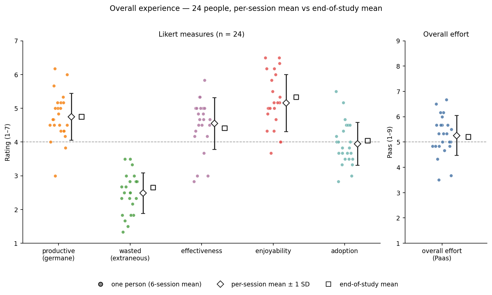
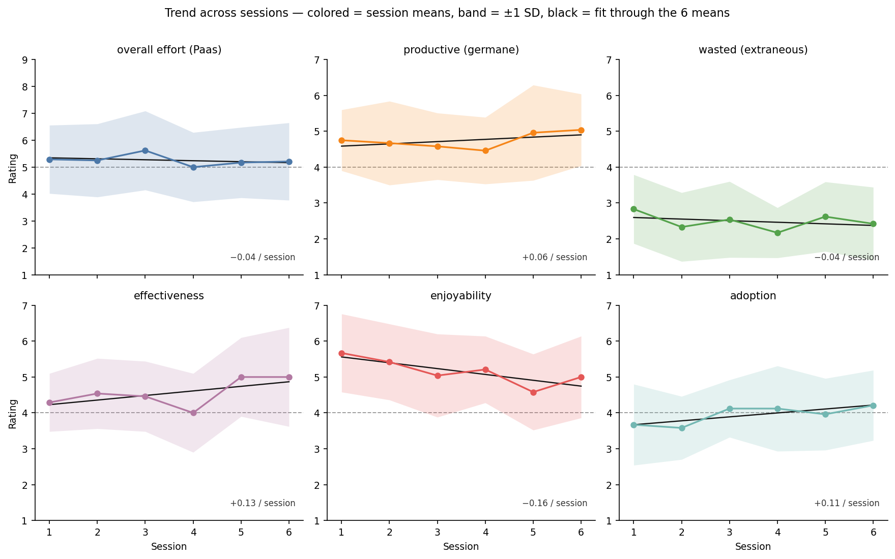
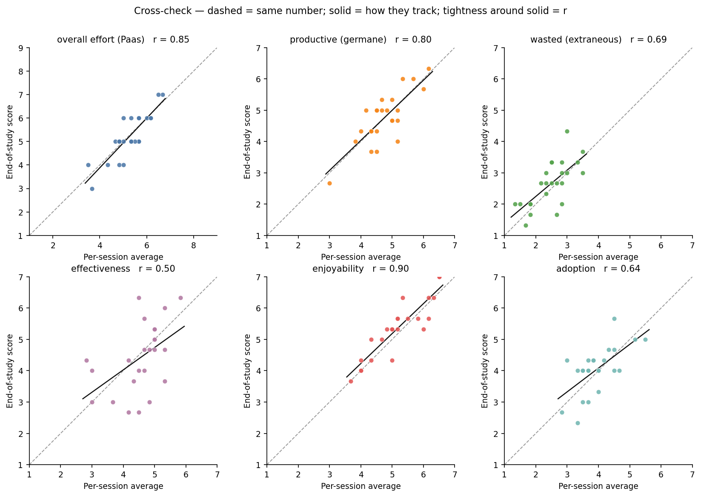
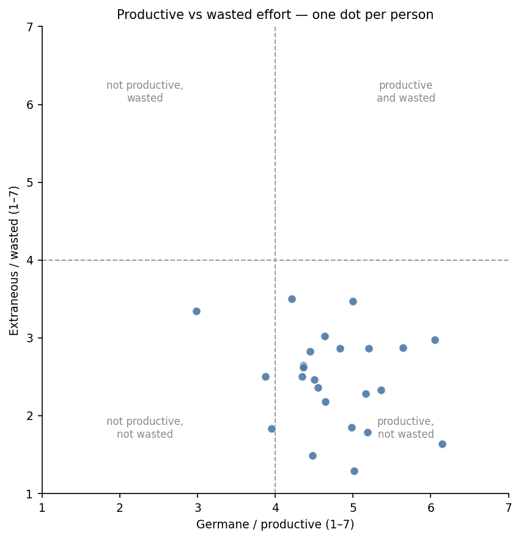

# RQ2 — User experience _(illustrative fake data)_

**Question.** How do users experience the interface: cognitive load (productive vs wasted), perceived effectiveness, enjoyability, and willingness to adopt?

**Data.**

- N = 24.
- Per-session: one item each, 6 sessions.
- End-of-study: 3-item scales of the same constructs, plus one Paas item (1–9).

**Descriptive only.**

- Person is the unit: each per-session score below is that person’s mean across 6 sessions, unless a figure is explicitly by session.

**How to read the scales.**

- Paas 1–9: overall mental effort; 5 = medium.
- Likert 1–7: **4 = midpoint**. Above 4 = leans agree; below 4 = leans disagree.
- For wasted effort, _lower is better_.

---

## 1. Overall experience

- Each **dot** is one person (mean of their 6 session ratings).
- **Open diamond** = per-session mean; bar = **±1 SD**.
- **Open square** = end-of-study mean (the group, not 24 extra dots).
- Dashed line = scale midpoint.

**Read.**

- Effort was moderate (Paas session mean 5.26 / 9, SD 0.79; end-of-study 5.21).
- People slightly agreed that the effort was worthwhile (germane 4.74) and that comments helped them think (effectiveness 4.55).
- They enjoyed the sessions (5.15).
- They **disagreed** that effort was wasted (extraneous 2.48).
- Adoption sat near the midpoint (3.94): not rejection, not enthusiasm.
- Open squares sit next to the diamonds — retrospective means land with the session means.

**Matching table** (diamond = session mean ± SD; square = end-of-study mean):

| measure       | session mean | SD   | min  | max  | end-of-study mean | n   |
| ------------- | ------------ | ---- | ---- | ---- | ----------------- | --- |
| paas_effort   | 5.26         | 0.79 | 3.50 | 6.67 | 5.21              | 24  |
| germane       | 4.74         | 0.69 | 3.00 | 6.17 | 4.75              | 24  |
| extraneous    | 2.48         | 0.60 | 1.33 | 3.50 | 2.65              | 24  |
| effectiveness | 4.55         | 0.77 | 2.83 | 5.83 | 4.42              | 24  |
| enjoyability  | 5.15         | 0.84 | 3.67 | 6.50 | 5.33              | 24  |
| adoption      | 3.94         | 0.64 | 2.83 | 5.50 | 4.04              | 24  |

**Person-level values plotted as dots:**

| participant_id | paas_effort | germane | extraneous | effectiveness | enjoyability | adoption |
| -------------- | ----------- | ------- | ---------- | ------------- | ------------ | -------- |
| 1              | 4.83        | 5.17    | 1.83       | 4.50          | 5.17         | 4.17     |
| 2              | 4.67        | 3.83    | 2.50       | 3.00          | 4.67         | 3.83     |
| 3              | 5.67        | 5.33    | 2.33       | 5.33          | 6.17         | 4.00     |
| 4              | 5.67        | 5.67    | 2.83       | 4.83          | 6.50         | 4.00     |
| 5              | 6.67        | 3.00    | 3.33       | 2.83          | 4.00         | 3.50     |
| 6              | 5.67        | 4.17    | 3.50       | 5.33          | 4.00         | 3.67     |
| 7              | 6.50        | 4.50    | 2.83       | 4.50          | 6.17         | 4.33     |
| 8              | 4.83        | 4.33    | 2.67       | 5.00          | 4.33         | 3.50     |
| 9              | 4.83        | 4.33    | 2.67       | 4.17          | 5.00         | 3.67     |
| 10             | 3.50        | 5.00    | 3.50       | 4.67          | 4.00         | 3.33     |
| 11             | 5.00        | 5.00    | 1.83       | 4.67          | 5.17         | 4.50     |
| 12             | 6.17        | 6.17    | 1.67       | 5.00          | 4.83         | 4.50     |
| 13             | 5.33        | 4.50    | 1.50       | 4.67          | 5.33         | 3.67     |
| 14             | 4.33        | 5.17    | 2.33       | 3.67          | 6.00         | 4.67     |
| 15             | 3.67        | 4.83    | 2.83       | 5.00          | 5.00         | 3.83     |
| 16             | 5.67        | 4.50    | 2.50       | 4.33          | 3.67         | 3.00     |
| 17             | 5.50        | 6.00    | 3.00       | 5.00          | 5.83         | 3.67     |
| 18             | 6.00        | 5.17    | 2.83       | 3.00          | 5.00         | 3.33     |
| 19             | 5.00        | 4.33    | 2.50       | 5.33          | 6.50         | 5.50     |
| 20             | 4.83        | 4.50    | 2.33       | 4.17          | 6.33         | 3.50     |
| 21             | 5.33        | 4.67    | 2.17       | 4.50          | 5.50         | 4.50     |
| 22             | 5.33        | 4.67    | 3.00       | 5.00          | 4.33         | 2.83     |
| 23             | 6.17        | 5.00    | 1.33       | 5.83          | 5.00         | 5.17     |
| 24             | 5.00        | 4.00    | 1.83       | 4.83          | 5.17         | 4.00     |

---

## 2. Change across sessions

- Colored line = mean of 24 people that session.
- Band = **±1 SD** (how much people differed that day), **not** a 95% confidence interval.
- **Black line** = ordinary least squares through those 6 means (y = a + b x). A ruler for tilt, not a claim that the path was straight. No CI on this line.
- Number on each panel = slope b (change per session). Dashed line = midpoint.

**Read.**

- If the black line is almost horizontal **and** the six session means wander around it, the measure is flat. Paas, germane, and extraneous are in that bucket.
- **Enjoyability** is the one clear tilt: 5.67 in session 1 → 5.00 in session 6 (−0.16 / session). Novelty fade, not a collapse — session 6 is still above the midpoint.
- Effectiveness (+0.13 / session) and adoption (+0.11 / session) slope up a little, but the path is jumpy (dip at S4, then a step). Trust S1 vs S6 more than the straight line. Posts are rotated, so that dip is not one post.
- Wasted effort stays low the whole way. ±1 SD is ~1 point, so 0.3 wiggles are small next to how much people disagree with each other.

**Matching table** — each cell is mean (SD), n = 24. Fit slope is the black line.

| measure       | S1          | S2          | S3          | S4          | S5          | S6          | fit slope       |
| ------------- | ----------- | ----------- | ----------- | ----------- | ----------- | ----------- | --------------- |
| paas_effort   | 5.29 (1.27) | 5.25 (1.36) | 5.62 (1.47) | 5.00 (1.29) | 5.17 (1.31) | 5.21 (1.44) | −0.04 / session |
| germane       | 4.75 (0.85) | 4.67 (1.17) | 4.58 (0.93) | 4.46 (0.93) | 4.96 (1.33) | 5.04 (1.00) | +0.06 / session |
| extraneous    | 2.83 (0.96) | 2.33 (0.96) | 2.54 (1.06) | 2.17 (0.70) | 2.62 (0.97) | 2.42 (1.02) | −0.04 / session |
| effectiveness | 4.29 (0.81) | 4.54 (0.98) | 4.46 (0.98) | 4.00 (1.10) | 5.00 (1.10) | 5.00 (1.38) | +0.13 / session |
| enjoyability  | 5.67 (1.09) | 5.42 (1.06) | 5.04 (1.16) | 5.21 (0.93) | 4.58 (1.06) | 5.00 (1.14) | −0.16 / session |
| adoption      | 3.67 (1.13) | 3.58 (0.88) | 4.12 (0.80) | 4.12 (1.19) | 3.96 (1.00) | 4.21 (0.98) | +0.11 / session |

---

## 3. End-of-study scales

Fuller 3-item versions, one score per person (n = 24). Paas is a single item, so no alpha. No figure: this table is the result. Group means also appear as the open squares in Section 1.

| scale         | α    | mean | SD   |
| ------------- | ---- | ---- | ---- |
| paas_effort   | —    | 5.21 | 0.98 |
| germane       | 0.76 | 4.75 | 0.84 |
| extraneous    | 0.79 | 2.65 | 0.73 |
| effectiveness | 0.86 | 4.42 | 1.10 |
| enjoyability  | 0.81 | 5.33 | 0.90 |
| adoption      | 0.58 | 4.04 | 0.76 |

**Read.**

- Four scales hang together (α ≥ .70) — averaging the 3 items is fine.
- Retrospective scores match the per-session story: moderate effort, productive not wasted, mild effectiveness, clear enjoyment, lukewarm adoption.

**Adoption (α = 0.58).** Items do not move as one. Report the pieces:

| item                                        | mean | SD   |
| ------------------------------------------- | ---- | ---- |
| I'd use a tool like this if available       | 4.67 | 0.87 |
| I'd recommend it to a friend                | 3.75 | 1.22 |
| I'd want this built into apps I already use | 3.71 | 0.95 |

- People are more willing to **use it themselves** than to recommend it or want it in existing apps.
- Do not treat α = 0.58 as a failed study; do not hide it either.
- The Section 4 _r_ for adoption is against this loose average — read it loosely. The per-session item is closest to “I’d use it.”

---

## 4. Do the light items match the full scales?

- One dot = one person.
- **Dashed line** = same number both times (_y = x_).
- **Solid line** = best-fit: if I know the session average, what end-of-study score should I expect?
- **_r_** = **Pearson** correlation: how tightly the dots hug the **solid** line, not the dashed one. Pearson matches that OLS line (it is the standardized slope). Spearman is not used here.

|          | What _r_ means here                                                               |
| -------- | --------------------------------------------------------------------------------- |
| ~.80+    | Thin cigar around the solid line — the light item tracked the full scale          |
| ~.50–.70 | Same direction, fatter cloud — trust the **pattern**, not a person’s exact number |
| <.50     | Round / tall smear — the two questionnaires are not measuring the same thing      |

**Read.**

- Enjoyability (_r_ = 0.90) and Paas (_r_ = 0.85): thin along the solid line, and that line sits on the dashed diagonal — same ordering **and** similar numbers.
- Germane (_r_ = 0.80) is usable.
- Adoption (_r_ = 0.64) and extraneous (_r_ = 0.69) are weaker (fatter around the solid line). Adoption’s _r_ is also against a scale with α = .58.
- Effectiveness (_r_ = 0.50) is the mismatch: at a session mean of ~4.5, end-of-study scores run from about 2.7 to 6.3. That vertical smear **is** the lower _r_. In-the-moment “this session helped” and retrospective “the tool improved my thinking” are related but not the same.

**Matching table** (same pairs as the figure):

| measure       | Pearson r | per-session mean | end-of-study mean |
| ------------- | --------- | ---------------- | ----------------- |
| paas_effort   | 0.85      | 5.26             | 5.21              |
| germane       | 0.80      | 4.74             | 4.75              |
| extraneous    | 0.69      | 2.48             | 2.65              |
| effectiveness | 0.50      | 4.55             | 4.42              |
| enjoyability  | 0.90      | 5.15             | 5.33              |
| adoption      | 0.64      | 3.94             | 4.04              |

**Person-level values plotted as dots:**

| participant_id | paas_effort_ps | paas_effort_eos | germane_ps | germane_eos | extraneous_ps | extraneous_eos | effectiveness_ps | effectiveness_eos | enjoyability_ps | enjoyability_eos | adoption_ps | adoption_eos |
| -------------- | -------------- | --------------- | ---------- | ----------- | ------------- | -------------- | ---------------- | ----------------- | --------------- | ---------------- | ----------- | ------------ |
| 1              | 4.83           | 5.00            | 5.17       | 4.67        | 1.83          | 2.00           | 4.50             | 2.67              | 5.17            | 5.67             | 4.17        | 4.33         |
| 2              | 4.67           | 5.00            | 3.83       | 4.00        | 2.50          | 2.67           | 3.00             | 4.00              | 4.67            | 5.00             | 3.83        | 4.33         |
| 3              | 5.67           | 5.00            | 5.33       | 6.00        | 2.33          | 2.67           | 5.33             | 3.67              | 6.17            | 5.67             | 4.00        | 3.33         |
| 4              | 5.67           | 6.00            | 5.67       | 6.00        | 2.83          | 3.33           | 4.83             | 3.00              | 6.50            | 7.00             | 4.00        | 4.00         |
| 5              | 6.67           | 7.00            | 3.00       | 2.67        | 3.33          | 3.33           | 2.83             | 4.33              | 4.00            | 4.00             | 3.50        | 3.00         |
| 6              | 5.67           | 5.00            | 4.17       | 5.00        | 3.50          | 3.67           | 5.33             | 6.00              | 4.00            | 4.33             | 3.67        | 3.00         |
| 7              | 6.50           | 7.00            | 4.50       | 3.67        | 2.83          | 2.00           | 4.50             | 6.33              | 6.17            | 6.33             | 4.33        | 4.67         |
| 8              | 4.83           | 5.00            | 4.33       | 4.33        | 2.67          | 1.67           | 5.00             | 4.67              | 4.33            | 5.00             | 3.50        | 4.00         |
| 9              | 4.83           | 4.00            | 4.33       | 4.33        | 2.67          | 2.67           | 4.17             | 2.67              | 5.00            | 5.33             | 3.67        | 4.00         |
| 10             | 3.50           | 4.00            | 5.00       | 4.67        | 3.50          | 3.00           | 4.67             | 4.00              | 4.00            | 4.00             | 3.33        | 2.33         |
| 11             | 5.00           | 5.00            | 5.00       | 4.67        | 1.83          | 1.67           | 4.67             | 4.67              | 5.17            | 5.33             | 4.50        | 4.67         |
| 12             | 6.17           | 6.00            | 6.17       | 6.33        | 1.67          | 1.33           | 5.00             | 5.00              | 4.83            | 5.33             | 4.50        | 4.00         |
| 13             | 5.33           | 5.00            | 4.50       | 5.00        | 1.50          | 2.00           | 4.67             | 5.67              | 5.33            | 6.33             | 3.67        | 4.33         |
| 14             | 4.33           | 4.00            | 5.17       | 5.00        | 2.33          | 2.33           | 3.67             | 3.00              | 6.00            | 5.33             | 4.67        | 4.00         |
| 15             | 3.67           | 3.00            | 4.83       | 5.00        | 2.83          | 2.67           | 5.00             | 5.33              | 5.00            | 4.33             | 3.83        | 4.33         |
| 16             | 5.67           | 6.00            | 4.50       | 4.33        | 2.50          | 3.33           | 4.33             | 3.67              | 3.67            | 3.67             | 3.00        | 4.33         |
| 17             | 5.50           | 5.00            | 6.00       | 5.67        | 3.00          | 4.33           | 5.00             | 5.33              | 5.83            | 5.67             | 3.67        | 4.00         |
| 18             | 6.00           | 6.00            | 5.17       | 4.00        | 2.83          | 3.00           | 3.00             | 3.00              | 5.00            | 5.33             | 3.33        | 4.00         |
| 19             | 5.00           | 4.00            | 4.33       | 3.67        | 2.50          | 3.33           | 5.33             | 4.67              | 6.50            | 7.00             | 5.50        | 5.00         |
| 20             | 4.83           | 5.00            | 4.50       | 5.00        | 2.33          | 3.00           | 4.17             | 4.33              | 6.33            | 6.33             | 3.50        | 4.00         |
| 21             | 5.33           | 5.00            | 4.67       | 5.00        | 2.17          | 2.67           | 4.50             | 4.00              | 5.50            | 5.67             | 4.50        | 5.67         |
| 22             | 5.33           | 6.00            | 4.67       | 5.33        | 3.00          | 3.00           | 5.00             | 5.00              | 4.33            | 4.33             | 2.83        | 2.67         |
| 23             | 6.17           | 6.00            | 5.00       | 5.33        | 1.33          | 2.00           | 5.83             | 6.33              | 5.00            | 5.33             | 5.17        | 5.00         |
| 24             | 5.00           | 6.00            | 4.00       | 4.33        | 1.83          | 2.00           | 4.83             | 4.67              | 5.17            | 5.67             | 4.00        | 4.00         |

---

## 5. Productive vs wasted effort

One panel, n = 24 person-means (same germane and extraneous columns as Section 1). Vertical line at germane = 4; horizontal at extraneous = 4.

**Read.**

- Almost everyone is in **useful, not wasted**: effort felt worthwhile _and_ not confusing. That is the cognitive-load answer to RQ2.

**Quadrant counts** (the four regions in the figure):

| quadrant (lines at 4, 4)                               | n   |
| ------------------------------------------------------ | --- |
| useful, not wasted (germane ≥ 4, extraneous < 4)       | 22  |
| useful, but confusing (germane ≥ 4, extraneous ≥ 4)    | 0   |
| pointless, not confusing (germane < 4, extraneous < 4) | 2   |
| pointless and confusing (germane < 4, extraneous ≥ 4)  | 0   |

**Matching table** (same 24 dots):

| participant_id | germane | extraneous |
| -------------- | ------- | ---------- |
| 1              | 5.17    | 1.83       |
| 2              | 3.83    | 2.50       |
| 3              | 5.33    | 2.33       |
| 4              | 5.67    | 2.83       |
| 5              | 3.00    | 3.33       |
| 6              | 4.17    | 3.50       |
| 7              | 4.50    | 2.83       |
| 8              | 4.33    | 2.67       |
| 9              | 4.33    | 2.67       |
| 10             | 5.00    | 3.50       |
| 11             | 5.00    | 1.83       |
| 12             | 6.17    | 1.67       |
| 13             | 4.50    | 1.50       |
| 14             | 5.17    | 2.33       |
| 15             | 4.83    | 2.83       |
| 16             | 4.50    | 2.50       |
| 17             | 6.00    | 3.00       |
| 18             | 5.17    | 2.83       |
| 19             | 4.33    | 2.50       |
| 20             | 4.50    | 2.33       |
| 21             | 4.67    | 2.17       |
| 22             | 4.67    | 3.00       |
| 23             | 5.00    | 1.33       |
| 24             | 4.00    | 1.83       |

---

## Takeaway

- Users spent moderate effort that felt **worthwhile rather than wasted**, found the sessions **enjoyable**, and only **slightly** agreed that comments sharpened their thinking.
- They were **undecided** about adopting the tool.
- Ratings were stable across six days except enjoyment, which eased off after session 1 but stayed positive.
- The short per-session items mostly agree with the fuller end-of-study scales, except effectiveness (noisier) and adoption (items do not form a tight scale).

---

### Figure index

- `img/01_overall_experience.png` — 24 dots, per-session mean ± 1 SD (open diamond), end-of-study mean (open square)
- `img/02_trends.png` — session means ± 1 SD, plus a straight fit through the 6 means
- `img/03_crosscheck.png` — per-session average vs end-of-study (dashed = same number, solid = fit)
- `img/04_germane_vs_extraneous.png` — productive vs wasted effort
