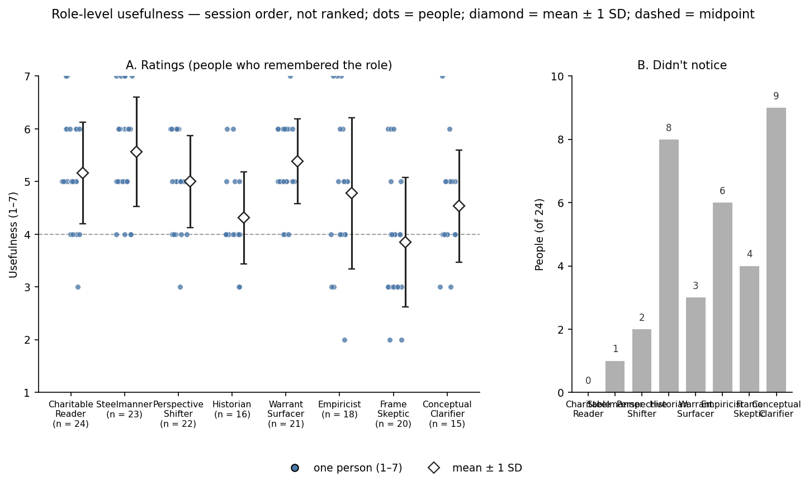
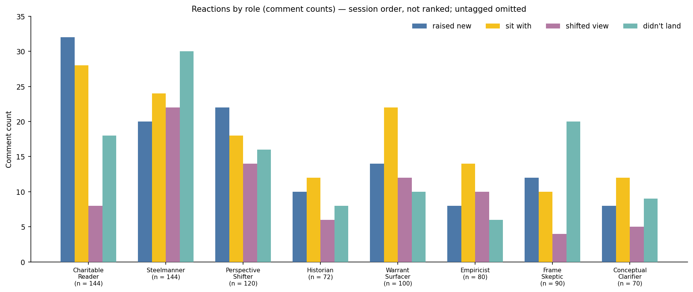
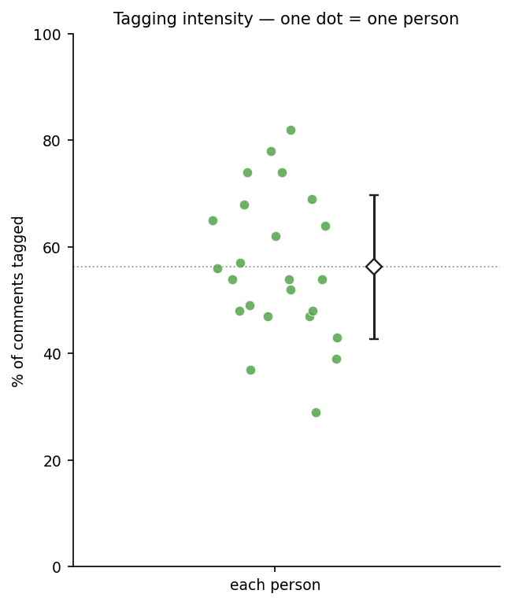
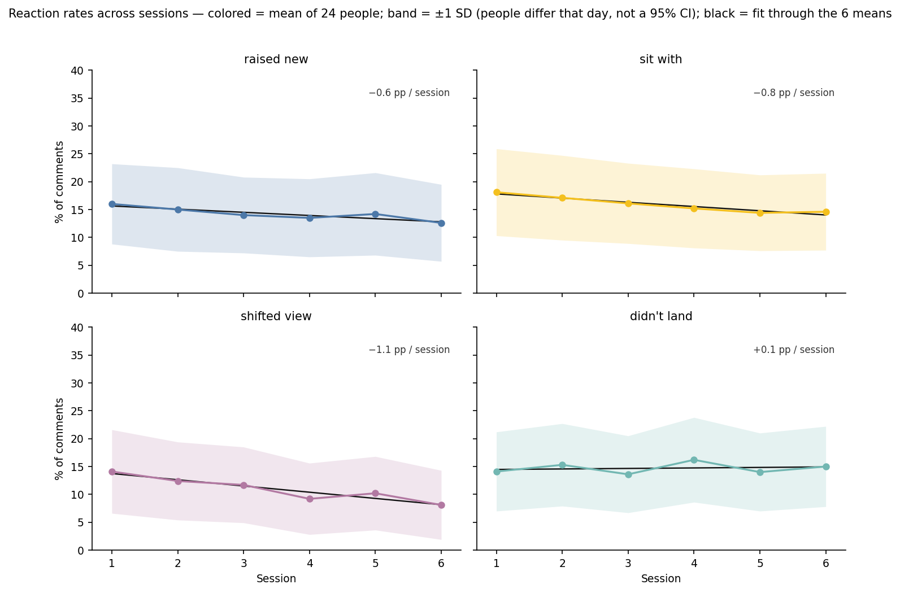
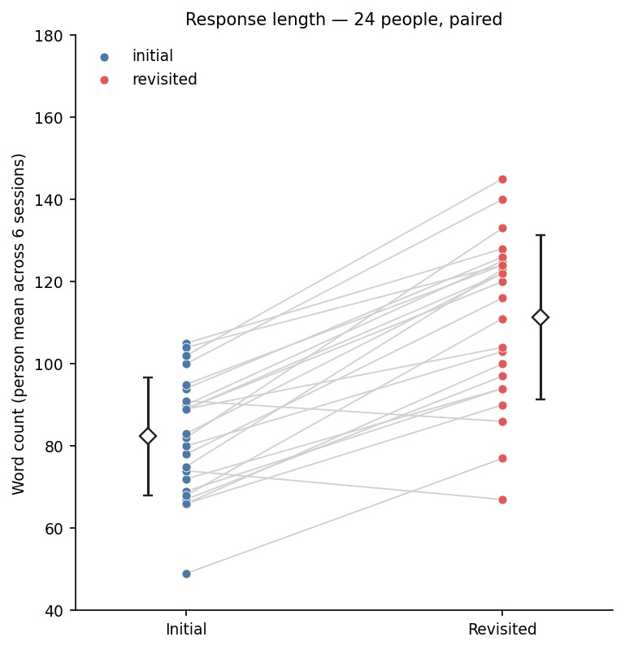
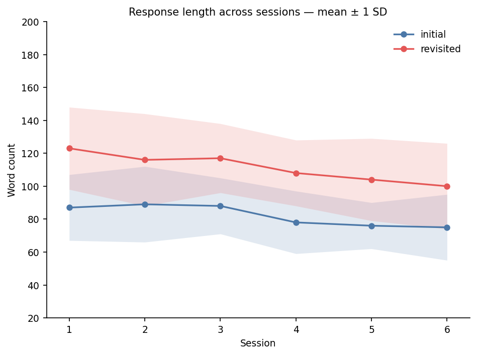
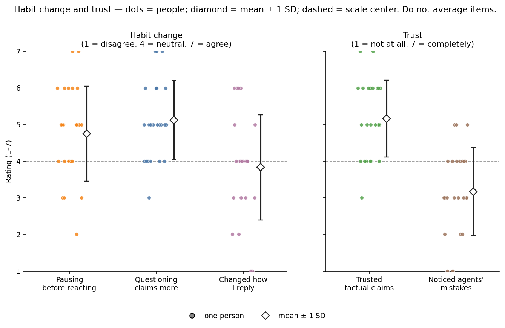

# RQ3 — Patterns *(illustrative fake data)*

**Question.** What patterns emerge across sessions, agent roles, response length, reaction and flagging behavior, and interview themes?

**Data.**
- N = 24. Six sessions. Eight roles in a **fixed order**. Post order is a 6×6 Latin square (session ≠ post).
- Not every role fires every session. `Load more` paces comments two at a time; revisit is locked until **every** generated comment has been shown.
- One reaction per comment: 🔔 raised something new, 🤔 worth sitting with, 🔄 shifted my view, 🤷 didn't land — or none. 🚩 is separate and can sit on top.
- Role usefulness and habit items are on the Session 7 form (listed under RQ2 in the proposal). Reported here: RQ3 is roles and outside-study patterns.

**Descriptive only.** Role differences may be the role, the **order**, or **how often it fired** — not “this role works better.” Rates: person first, then average. Counts: comments.

---

## 0. Exposure (read this before any role chart)

Later roles **fire** less often. They are not hidden. `n` = comments that existed; all were on screen. “Didn’t notice” is recall, not a skipped `Load more`.

| role (session order) | n comments | any reaction | flagged | didn’t notice (of 24) |
| --- | --- | --- | --- | --- |
| Charitable Reader | 144 | 86 | 2 | 0 |
| Steelmanner | 144 | 96 | 3 | 1 |
| Perspective Shifter | 120 | 70 | 1 | 2 |
| Historian | 72 | 36 | 4 | 8 |
| Warrant Surfacer | 100 | 58 | 2 | 3 |
| Empiricist | 80 | 38 | 6 | 6 |
| Frame Skeptic | 90 | 46 | 3 | 4 |
| Conceptual Clarifier | 70 | 34 | 1 | 9 |
| **Total** | **820** | **464** | **22** | — |

“Didn’t notice” = never fired **or** fired and the voice didn’t stick.

| role | people with ≥1 comment | didn’t notice | never fired | fired, still didn’t notice |
| --- | ---: | ---: | ---: | ---: |
| Charitable Reader | 24 | 0 | 0 | 0 |
| Steelmanner | 24 | 1 | 0 | 1 |
| Perspective Shifter | 23 | 2 | 1 | 1 |
| Historian | 18 | 8 | 6 | 2 |
| Warrant Surfacer | 22 | 3 | 2 | 1 |
| Empiricist | 20 | 6 | 4 | 2 |
| Frame Skeptic | 21 | 4 | 3 | 1 |
| Conceptual Clarifier | 17 | 9 | 7 | 2 |

**Read.** Charitable Reader and Steelmanner always applied (144 = 24 × 6). Of 9 “didn’t notice” for Conceptual Clarifier, 7 never had the role and 2 saw it. Any “later roles got fewer 🔄” claim has to survive this table.

---

## 1. Role-level usefulness and “didn’t notice”

End-of-study, one rating per role. Means use only 1–7. “Didn’t notice” is not a 1.

- **A.** Dot = person who remembered the role. Diamond = mean ± 1 SD. Dashed = midpoint (4). `n` = people who rated.
- **B.** Count who chose “Didn’t notice.” Split using Section 0 before treating it as salience.

| role | n rated | n didn’t notice | mean | SD |
| --- | --- | --- | --- | --- |
| Charitable Reader | 24 | 0 | 5.2 | 1.0 |
| Steelmanner | 23 | 1 | 5.6 | 1.0 |
| Perspective Shifter | 22 | 2 | 5.0 | 0.9 |
| Historian | 16 | 8 | 4.3 | 0.9 |
| Warrant Surfacer | 21 | 3 | 5.4 | 0.8 |
| Empiricist | 18 | 6 | 4.8 | 1.4 |
| Frame Skeptic | 20 | 4 | 3.9 | 1.2 |
| Conceptual Clarifier | 15 | 9 | 4.5 | 1.1 |

**Read.** Steelmanner and Warrant Surfacer sit highest among people who remember them. Frame Skeptic is the only mean below 4. Historian and Conceptual Clarifier are missing for a third of the sample — don’t compare those means to Charitable Reader’s.

**Most / least named** (open text; recall, not a test):

| named as helped most | n | named as helped least / annoyed | n |
| --- | --- | --- | --- |
| Steelmanner | 8 | Frame Skeptic | 7 |
| Warrant Surfacer | 6 | Historian | 5 |
| Charitable Reader | 4 | Conceptual Clarifier | 4 |
| Perspective Shifter | 3 | Steelmanner | 3 |
| Empiricist | 2 | Empiricist | 2 |
| other / none | 1 | other / none | 3 |

Steelmanner on **both** lists: polarizing, not “best.”

**Person-level usefulness** (— = didn’t notice). IDs are arbitrary; rows are not sorted by completeness.

| participant_id | Charitable | Steelmanner | Perspect. | Historian | Warrant | Empiricist | Frame Sk. | Concept. |
| --- | --- | --- | --- | --- | --- | --- | --- | --- |
| 1 | 5 | 5 | 6 | 4 | 6 | 7 | 3 | 5 |
| 2 | 3 | 6 | 6 | — | 5 | — | 3 | — |
| 3 | 5 | 5 | 5 | 4 | 6 | 6 | 6 | 4 |
| 4 | 6 | 7 | 6 | 4 | 6 | 7 | 5 | — |
| 5 | 7 | 5 | 5 | 3 | 5 | 6 | 3 | 3 |
| 6 | 6 | — | — | — | — | — | — | — |
| 7 | 5 | 4 | 6 | 5 | 5 | 5 | 6 | 4 |
| 8 | 4 | 7 | 5 | — | 6 | — | — | — |
| 9 | 6 | 6 | 4 | 4 | 4 | 5 | 5 | 4 |
| 10 | 4 | 4 | 4 | — | 6 | 3 | 4 | — |
| 11 | 5 | 5 | 5 | 4 | 6 | 5 | 4 | 5 |
| 12 | 5 | 6 | 5 | — | — | — | — | — |
| 13 | 6 | 6 | 4 | 4 | 7 | 4 | 2 | 4 |
| 14 | 6 | 5 | 3 | — | 6 | — | 3 | — |
| 15 | 5 | 7 | 5 | 5 | 4 | 5 | 3 | 5 |
| 16 | 5 | 4 | — | — | — | — | — | — |
| 17 | 6 | 6 | 5 | 6 | 6 | 4 | 2 | 5 |
| 18 | 5 | 7 | 4 | — | 5 | 7 | 3 | — |
| 19 | 4 | 4 | 5 | 4 | 5 | 5 | 6 | 3 |
| 20 | 4 | 7 | 6 | 6 | 4 | 4 | 4 | 6 |
| 21 | 7 | 6 | 4 | 3 | 6 | 3 | 3 | 4 |
| 22 | 5 | 5 | 6 | 4 | 5 | 4 | 4 | 4 |
| 23 | 5 | 6 | 6 | 5 | 5 | 2 | 4 | 5 |
| 24 | 5 | 5 | 5 | 4 | 5 | 4 | 4 | 7 |

---

## 2. Reactions by role — counts, not 100% stacks

Y = **comment count**. Four bars per role; untagged omitted (it would swallow the chart). Session order.

| role | n | 🔔 | 🤔 | 🔄 | 🤷 | untagged | % tagged | % 🔄 | % 🤷 |
| --- | --- | --- | --- | --- | --- | --- | --- | --- | --- |
| Charitable Reader | 144 | 32 | 28 | 8 | 18 | 58 | 59.7 | 5.6 | 12.5 |
| Steelmanner | 144 | 20 | 24 | 22 | 30 | 48 | 66.7 | 15.3 | 20.8 |
| Perspective Shifter | 120 | 22 | 18 | 14 | 16 | 50 | 58.3 | 11.7 | 13.3 |
| Historian | 72 | 10 | 12 | 6 | 8 | 36 | 50.0 | 8.3 | 11.1 |
| Warrant Surfacer | 100 | 14 | 22 | 12 | 10 | 42 | 58.0 | 12.0 | 10.0 |
| Empiricist | 80 | 8 | 14 | 10 | 6 | 42 | 47.5 | 12.5 | 7.5 |
| Frame Skeptic | 90 | 12 | 10 | 4 | 20 | 44 | 51.1 | 4.4 | 22.2 |
| Conceptual Clarifier | 70 | 8 | 12 | 5 | 9 | 36 | 48.6 | 7.1 | 12.9 |

Comment-pooled % can be owned by heavy taggers. Person-mean % = each person’s share of *their* comments from that role, then the mean of people who saw it.

| role | % 🔄 (comments) | % 🔄 (person-mean) | % 🤷 (comments) | % 🤷 (person-mean) |
| --- | ---: | ---: | ---: | ---: |
| Charitable Reader | 5.6 | 6.1 | 12.5 | 13.4 |
| Steelmanner | 15.3 | 14.4 | 20.8 | 19.8 |
| Perspective Shifter | 11.7 | 12.2 | 13.3 | 13.6 |
| Historian | 8.3 | 9.1 | 11.1 | 11.8 |
| Warrant Surfacer | 12.0 | 11.5 | 10.0 | 10.6 |
| Empiricist | 12.5 | 13.2 | 7.5 | 7.4 |
| Frame Skeptic | 4.4 | 5.0 | 22.2 | 21.8 |
| Conceptual Clarifier | 7.1 | 7.8 | 12.9 | 13.5 |

**Read.** Most tagging sits on the first two roles — they applied every session. Steelmanner has the most 🔄 (22) and 🤷 (30). Frame Skeptic’s 🤷 bar (20) is high despite fewer comments. Charitable Reader’s 🔄 bar is short (8).

Percents: 🔄 is 5.6% of Charitable Reader vs 15.3% of Steelmanner and 12.5% of Empiricist (person-means 6.1, 14.4, 13.2). Empiricist’s 🔄 *count* (10) is unremarkable; its *rate* is not. Frame Skeptic’s 🤷 *rate* (22.2%; person-mean 21.8%) matches Steelmanner’s (20.8%; 19.8%) — counts alone make Steelmanner look like the only one that didn’t land. A 100% stack would make Empiricist and Historian look as “big” as Charitable Reader.

---

## 3. Are a few people doing all the tagging?

Dot = that person’s % of *their* comments with any reaction. Diamond = mean ± 1 SD.

| measure | mean | SD | min | max | n |
| --- | ---: | ---: | ---: | ---: | ---: |
| % of comments tagged | 56 | 14 | 29 | 82 | 24 |

**Read.** Spread is wide (29–82%). One person under 30%; four at ≥70%. Figure 2 is comment totals, so heavy taggers weigh more there. Group rate here (56%) matches 464 / 820 = 56.6%.

---

## 4. Reactions across sessions

Y = each person’s % of comments that session, then the mean of 24. Band = ±1 SD (**people differed that day, not a 95% CI**). Y is 0–40 so a 4-point wiggle is not a cliff. Black line = fit through the 6 means (tilt, not “the path was straight”). Untagged omitted; the four series do not sum to 100%.

| % of comments (mean of 24 people) | S1 | S2 | S3 | S4 | S5 | S6 | fit slope |
| --- | --- | --- | --- | --- | --- | --- | --- |
| raised new | 16.0 | 15.0 | 14.0 | 13.5 | 14.2 | 12.6 | −0.6 pp / session |
| sit with | 18.1 | 17.1 | 16.1 | 15.2 | 14.4 | 14.6 | −0.8 pp / session |
| shifted view | 14.1 | 12.4 | 11.7 | 9.2 | 10.2 | 8.1 | −1.1 pp / session |
| didn't land | 14.1 | 15.3 | 13.6 | 16.2 | 14.0 | 15.0 | +0.1 pp / session |

Raw 🔄 **counts** (no person-averaging): S1 18, S2 16, S3 14, S4 11, S5 12, S6 10. Same tilt. Each session has ~136–140 comments, so counts here are safer than in Figure 2. Still report the %.

Same rates by **post** (everyone saw every post, different session slots):

| % of comments (mean of 24 people) | P1 | P2 | P3 | P4 | P5 | P6 |
| --- | --- | --- | --- | --- | --- | --- |
| raised new | 14.8 | 13.2 | 15.1 | 14.0 | 13.6 | 14.6 |
| sit with | 16.2 | 15.4 | 16.8 | 15.1 | 16.0 | 15.9 |
| shifted view | 11.4 | 10.8 | 10.2 | 12.1 | 10.6 | 11.0 |
| didn't land | 14.8 | 15.6 | 13.9 | 14.4 | 15.2 | 14.3 |

**Read.** 🔄 eases off after session 1 (−1.1 pp / session); 🤷 does not — rarer shifts, not more annoyance. 🔄 by post is 10.2–12.1; the session drop (14.1 → 8.1) is larger than any post gap, so this is not one stimulus in later slots.

---

## 5. Response length

**Figure 5a.** Person mean across 6 initials vs 6 revisited. Grey = the pair. Diamond = group mean ± 1 SD.

**Figure 5b.** Session means ± 1 SD.

| mean words (SD) | S1 | S2 | S3 | S4 | S5 | S6 |
| --- | --- | --- | --- | --- | --- | --- |
| initial | 87 (20) | 89 (23) | 88 (17) | 78 (19) | 76 (14) | 75 (20) |
| revisited | 123 (25) | 116 (28) | 117 (21) | 108 (20) | 104 (25) | 100 (26) |

Person-level means (5a) plus tagging rate (Figure 3):

| participant_id | initial words | revisited words | % tagged |
| --- | --- | --- | --- |
| 1 | 105 | 128 | 82 |
| 2 | 78 | 116 | 64 |
| 3 | 66 | 90 | 47 |
| 4 | 90 | 125 | 57 |
| 5 | 104 | 124 | 49 |
| 6 | 69 | 94 | 54 |
| 7 | 72 | 94 | 65 |
| 8 | 67 | 97 | 29 |
| 9 | 80 | 103 | 48 |
| 10 | 66 | 100 | 78 |
| 11 | 74 | 67 | 37 |
| 12 | 100 | 140 | 74 |
| 13 | 102 | 145 | 68 |
| 14 | 82 | 133 | 47 |
| 15 | 94 | 126 | 62 |
| 16 | 83 | 122 | 74 |
| 17 | 68 | 111 | 43 |
| 18 | 75 | 123 | 69 |
| 19 | 89 | 120 | 52 |
| 20 | 49 | 77 | 39 |
| 21 | 91 | 86 | 48 |
| 22 | 89 | 122 | 54 |
| 23 | 95 | 124 | 54 |
| 24 | 89 | 104 | 56 |

| | initial | revisited |
| --- | ---: | ---: |
| person-mean | 82 | 111 |
| SD | 14 | 20 |

**Read.** Revisited is longer for 22 of 24 (shorter: p11 74 → 67; p21 91 → 86). Both session lines drift down (fatigue, or settling near the length gate). Y is **word count**; the 300-character rule is only a scoring gate. Whether IC still moves after length is RQ1, not this figure.

---

## 6. Flags

22 flags in 820 comments (2.7%). Too sparse for a chart.

| role | n | n flagged | % |
| --- | --- | --- | --- |
| Charitable Reader | 144 | 2 | 1.4 |
| Steelmanner | 144 | 3 | 2.1 |
| Perspective Shifter | 120 | 1 | 0.8 |
| Historian | 72 | 4 | 5.6 |
| Warrant Surfacer | 100 | 2 | 2.0 |
| Empiricist | 80 | 6 | 7.5 |
| Frame Skeptic | 90 | 3 | 3.3 |
| Conceptual Clarifier | 70 | 1 | 1.4 |

| | S1 | S2 | S3 | S4 | S5 | S6 |
| --- | ---: | ---: | ---: | ---: | ---: | ---: |
| n flagged | 4 | 3 | 4 | 5 | 3 | 3 |

**Audit** (two researchers vs outside sources):

| sort | n |
| --- | ---: |
| Genuine error | 7 |
| Defensible but debatable | 9 |
| Plain disagreement | 6 |

Coder agreement: **18 / 22** (82%). Disagreements: 3 genuine vs debatable, 1 debatable vs disagreement. The table *is* the result.

Empiricist and Historian carry more flags — more checkable claims, not a bar chart of 1–6. Sessions stay at 3–5; no trend.

---

## 7. Habit change and trust

Dots = people; diamond = mean ± 1 SD. **Do not average** the three habit items or the two trust items (different anchors → two panels).

| item | mean | SD | n below 4 | n = 4 | n above 4 |
| --- | --- | --- | --- | --- | --- |
| Pausing before reacting | 4.8 | 1.3 | 4 | 6 | 14 |
| Questioning claims more | 5.1 | 1.1 | 1 | 6 | 17 |
| Changed how I reply | 3.8 | 1.4 | 8 | 10 | 6 |
| Trusted factual claims | 5.2 | 1.0 | 1 | 6 | 17 |
| Noticed agents' mistakes | 3.2 | 1.2 | 14 | 7 | 3 |

**Person-level values plotted as dots:**

| participant_id | pause | question claims | changed replies | trusted claims | noticed mistakes |
| --- | --- | --- | --- | --- | --- |
| 1 | 7 | 6 | 4 | 5 | 3 |
| 2 | 5 | 6 | 1 | 7 | 1 |
| 3 | 5 | 7 | 4 | 7 | 2 |
| 4 | 3 | 5 | 4 | 6 | 3 |
| 5 | 4 | 4 | 2 | 6 | 5 |
| 6 | 7 | 6 | 6 | 4 | 4 |
| 7 | 6 | 6 | 2 | 5 | 5 |
| 8 | 6 | 4 | 5 | 4 | 4 |
| 9 | 5 | 4 | 1 | 3 | 4 |
| 10 | 4 | 5 | 4 | 5 | 4 |
| 11 | 6 | 5 | 5 | 6 | 3 |
| 12 | 3 | 3 | 3 | 5 | 2 |
| 13 | 5 | 5 | 4 | 5 | 1 |
| 14 | 6 | 5 | 4 | 6 | 5 |
| 15 | 4 | 4 | 4 | 4 | 4 |
| 16 | 4 | 4 | 6 | 4 | 3 |
| 17 | 5 | 5 | 4 | 5 | 4 |
| 18 | 2 | 6 | 6 | 6 | 3 |
| 19 | 6 | 7 | 3 | 6 | 3 |
| 20 | 3 | 5 | 3 | 6 | 2 |
| 21 | 5 | 5 | 3 | 6 | 3 |
| 22 | 5 | 7 | 4 | 4 | 1 |
| 23 | 4 | 4 | 4 | 4 | 3 |
| 24 | 4 | 5 | 6 | 5 | 4 |

**Read.** People slightly agree they pause and question more; changing how they *reply* sits near the midpoint. Trust in claims is high; noticing mistakes is low — not a failure, it matches 22 flags. Self-report, no baseline, sample already wanted to improve critical thinking. Description, not transfer.

Open text + interview **Change**: quotes, not a graph. 11 people gave a concrete outside-study example; most of those had pause ≥ 5. Likert-high with no example = caveat in the text. (4 people sat below 4 on pausing.)

---

## 8. Interview themes *(table, not a frequency bar)*

Reflexive TA. Two researchers developed themes through discussion (no kappa). `n` = transcripts the theme showed up in, not importance.

| theme | what it is | example (fake) | n |
| --- | --- | --- | --- |
| Soft tone opened the door | Tentative phrasing vs normal replies | “It didn’t feel like a dunk, so I actually read it.” | 14 |
| Soft tone felt evasive | Same style, opposite read | “Just say you disagree. The hedging was annoying.” | 7 |
| One comment that landed | A single voice shifted the take | “The warrant one — I hadn’t seen the leap.” | 12 |
| Voices didn’t stick | Saw the comments, didn’t remember the role | “I know there were several, but I couldn’t tell them apart afterwards.” | 9 |
| Facts vs thinking | Useful even when untrusted | “I didn’t believe the stat, but the question was fair.” | 8 |
| Outside the tab | Pause on a real feed | “Caught myself typing a reply, deleted it, sat with it.” | 11 |

**Read.** Tone split the room (opened vs evasive) — style, not a role ranking. Figure 1B’s “didn’t notice” is voices that didn’t stick, not skipped comments. Habit items in Figure 6 live here as “outside the tab.”

---

## Takeaway *(this fake run)*

- First two roles ate the **volume**. Mix is different: Steelmanner high 🔄 and 🤷; Empiricist 🔄 *rate* > *count*; Frame Skeptic high 🤷 with fewer comments.
- 🔄 rarer across days (−1.1 pp / session); 🤷 not. By-post 🔄 is tight — not one stimulus.
- Revisited longer for almost everyone; both lines drifted down.
- Flags rare (22 / 820); most not clean errors; agreement 18/22.
- Usefulness high among people who remember a voice. Later voices missing more often = rarely fired + didn’t stick.
- Pause/question more than changing replies. Trust high; noticing mistakes low — matches sparse flags.
- Tone split the room. Style is its own pattern.

---

### Figure index

- `img/01_usefulness_and_notice.png` — strip + diamond by role (`n` rated); didn’t-notice counts; session order
- `img/02_reactions_counts_by_role.png` — clustered **counts**, 4 reaction types, n comments on x
- `img/03_tagging_intensity.png` — 24 dots, % tagged (person-mean 56%, matching 464/820)
- `img/04_reaction_rates_by_session.png` — mean % ± 1 SD (people differ, not a CI); fit through 6 means
- `img/05a_length_paired.png` — 24 paired initial vs revisited
- `img/05b_length_by_session.png` — two mean lines ± 1 SD
- `img/06_habits_and_trust.png` — habit vs trust panels; scale center at 4
